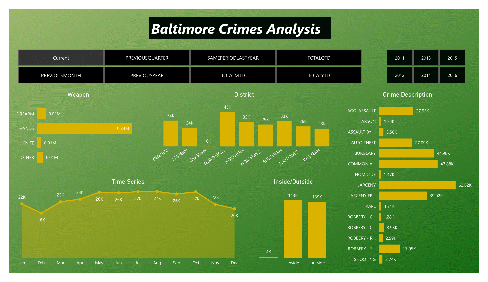

# ***Crimes Analysis***

## *Overview*
*This project offers an in-depth analysis of Crimes in Baltimore City leveraging **Power BI tools**. Key business metrics and trends are visualized through a comprehensive dashboard. The insights derived facilitate data-driven decision-making, aiding Crimes Reduction and Decline.*

## *To access the project online ,Click on the below link*

[*Baltimore_Crimes_Analysis_Using_Power_Bi link*](https://app.powerbi.com/view?r=eyJrIjoiOWViMzAzZDUtYzlhNC00YTU5LWJkMDEtZWVkMzE5ODNkZDUxIiwidCI6IjA5N2I0YWUwLWQwNmEtNGY4Mi1iODBhLTVmYWM1NTZjMDQzNyIsImMiOjl9)

## *Aim*
*The primary goal is to provide actionable insights into the Crimes in Baltimore City, pinpointing areas for High and dangerous Crimes through comprehensive analysis.*

## *Tools Utilized*
* *Microsoft Power BI*

## *Dashboard page*

### *Dashboard page Insights*

***Hands Crimes has the highest number of Crimes among Crimes Weapons*** 

***Larceny Crimes has the highest number of Crimes among other Kind Of Crimes*** 

***The North East Area has more crimes than other Areas***

***The Crimes Inside Homes Are More Than Outside***

## *Conclusion*
*This project harnesses Power BI's capabilities to empower stakeholders with a dynamic platform for Crimes Analysis. The derived insights lead to informed decisions and refined Crimes Reduction and Decline strategies.*
